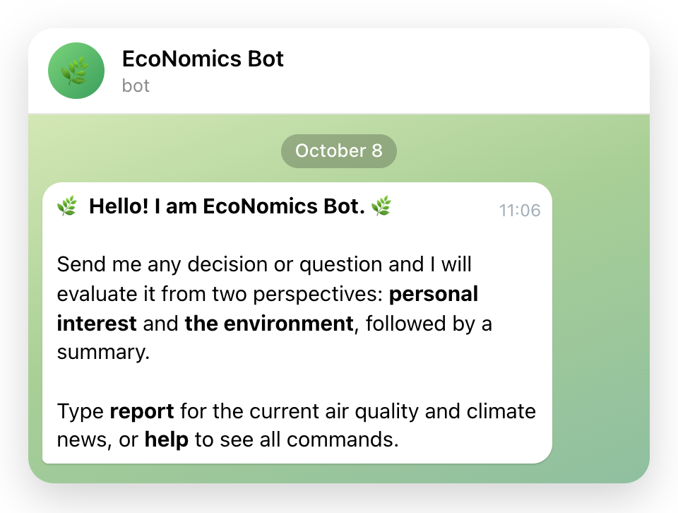
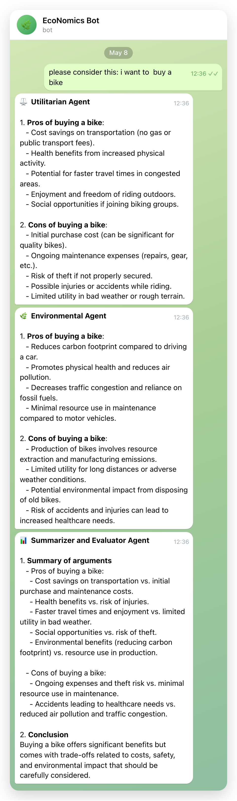
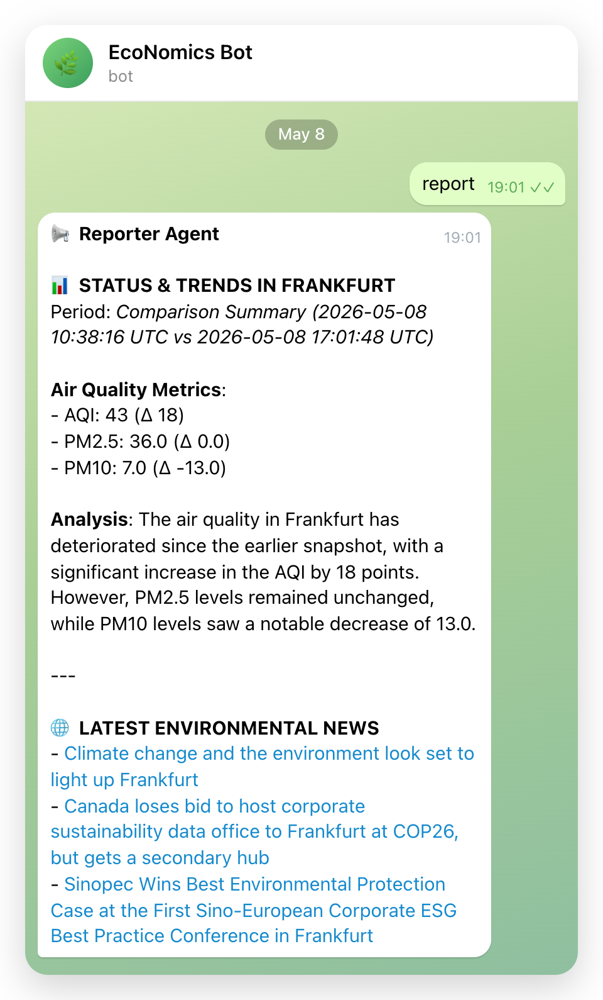
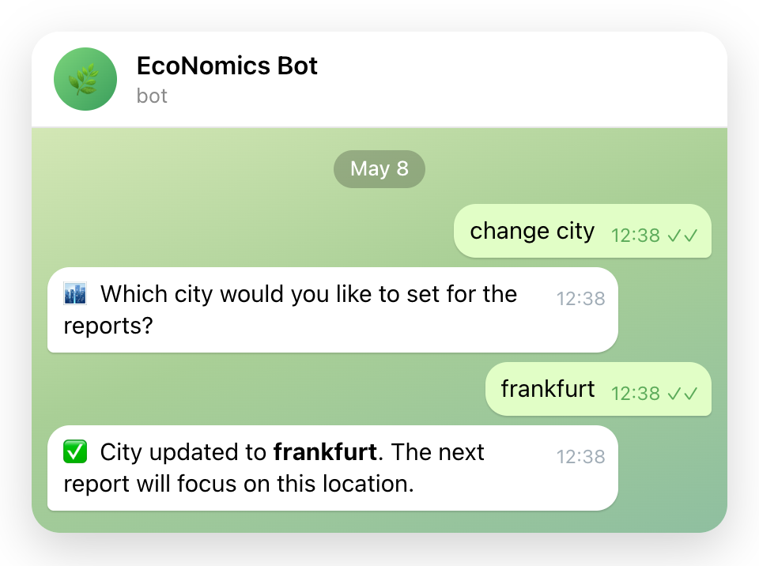
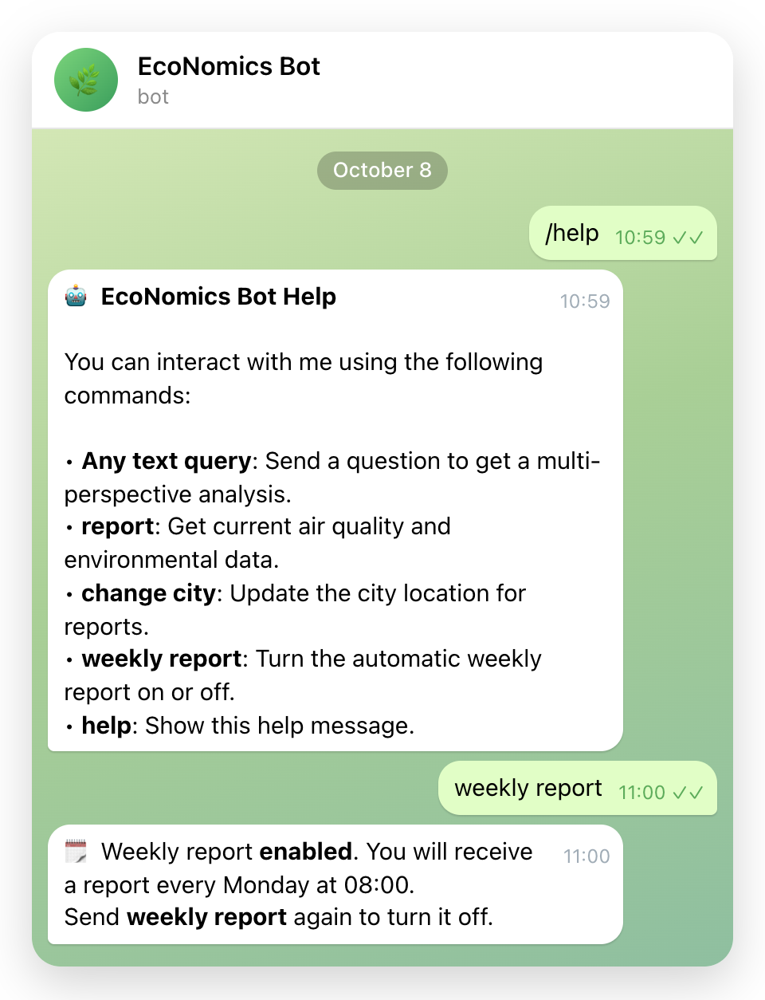
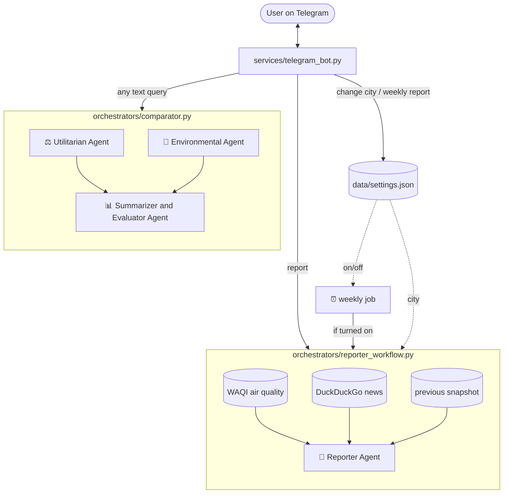

# EcoNomics Bot

EcoNomics Bot is an agentic decision-support system that evaluates decisions from two perspectives: personal interest and the environment. **Note: This project does not function as an actual decision maker; instead, it serves a supportive role in the process by evaluating issues from multiple perspectives.**

The system leverages specialized AI agents to analyze data, compile reports, and provide insights directly through a Telegram interface.

> **Project status:** Built in one week (May 2026) as a portfolio project; not actively maintained.

**Tech stack:** Python · asyncio · python-telegram-bot · OpenAI API (gpt-4o-mini) · WAQI API · DuckDuckGo Search

## Core Features

- **Multi-Perspective Evaluation**: Processes every query through two primary lenses:
    - **Utilitarian Perspective**: Weighs personal benefits and costs, such as money, time and convenience.
    - **Environmental (Green) Perspective**: Prioritizes ecological health and sustainability.
    - **Automatic Synthesis**: Every query concludes with a final summary and conclusion provided by the **Summarizer Agent**.
- **Environmental & Climate Reports**: Compiles up-to-date data including:
    - **Air Quality**: Current AQI, PM2.5 and PM10 values via the WAQI API.
    - **Climate News**: Recent local news on sustainability and climate change.
- **Trend Comparison**: Compares each report with the previous one to show how air quality has changed.
- **Weekly Report**: Optionally receive the report automatically once a week.

## Telegram Interaction

The primary way to interact with the system is through its Telegram bot. When it starts, the bot introduces itself:

<p align="center"></p>

Below are the available commands and interaction methods:

| Method / Command | Description |
| :--- | :--- |
| **Any text query** | Send any question to receive a comparative analysis from both the Utilitarian and Green agents, followed by an automatic summary and conclusion. |
| **`report`** or **`/report`** | Generates a summary of current air quality metrics, deltas from the previous report, and relevant climate news. |
| **`change city`** | Update the city used for reports. Once triggered, only the name of the city needs to be entered (e.g., Berlin). |
| **`weekly report`** or **`/weekly`** | Turns the automatic weekly report on or off. The schedule is set in `.env` (default: every Monday at 08:00). |
| **`help`** or **`/help`** | Displays available commands and usage information. |

| Any text query | `report` |
| :---: | :---: |
|  |  |
| **`change city`** | **`help` and `weekly report`** |
|  |  |

## Why Telegram?

- **Accessibility**: Works on mobile, desktop and web without building a custom frontend.
- **Push messages**: Agent replies arrive as soon as they are ready, and the weekly report is delivered without asking.
- **Rapid prototyping**: Telegram's API kept the focus on the agent logic rather than on UI work.

## System Architecture

How a Telegram message moves through the agents and the code:



Utilitarian and Environmental agents run in parallel; every agent calls the OpenAI API, and each reply is sent to Telegram as soon as it is ready.

## Project Structure

- `main.py`: Entry point that boots the Telegram bot and manages process lifecycle.
- `agents/`: Contains the logic for specialized AI agents (Green, Utilitarian, Reporter, Summarizer).
- `orchestrators/`: Manages workflows between agents, including comparison pipelines and report generation.
- `services/`: External integrations for Telegram, WAQI (Air Quality), DuckDuckGo Search, and local JSON storage.
- `config.py`: Centralized configuration and environment variable management.

## Setup & Installation

### Prerequisites

- Python 3.10+
- A Telegram Bot Token (from [@BotFather](https://t.me/botfather))
- An OpenAI API Key
- A WAQI API Token (from [aqicn.org](https://aqicn.org/api/))

### Configuration

1. Clone the repository:
   ```bash
   git clone https://github.com/SozialNomad/Economics-Bot.git
   cd Economics-Bot
   ```
2. Install dependencies (using a virtual environment is recommended but optional):
   ```bash
   python3 -m venv .venv
   source .venv/bin/activate
   pip install -r requirements.txt
   ```
3. Create a `.env` file in the project root with the following variables:
   ```env
   TELEGRAM_BOT_TOKEN=your_token_here
   TELEGRAM_CHAT_ID=your_chat_id_here
   OPENAI_API_KEY=your_openai_key_here
   AIR_QUALITY_API_KEY=your_waqi_token_here

   # Optional
   OPENAI_MODEL=gpt-4o-mini
   AIR_QUALITY_LOCATION=würzburg

   # Optional: weekly report schedule (local time)
   WEEKLY_REPORT_DAY=mon
   WEEKLY_REPORT_HOUR=8
   WEEKLY_REPORT_MINUTE=0
   ```

## Running the Project

To start the bot, run:
```bash
python main.py
```

On startup the bot stops any other running instance of this project and claims the Telegram polling session, so only one bot is active at a time.

## Limitations

- **Single user**: Designed for one Telegram chat. The city and weekly report settings are shared, not stored per user.
- **No fact-checking**: Agent answers come straight from the LLM and are not verified.
- **News quality**: The news search sometimes returns old or loosely related articles.
- **Weekly report needs a running bot**: Reports are only sent while `main.py` is running.

## License

This project is licensed under the MIT License - see the [LICENSE](LICENSE) file for details.
